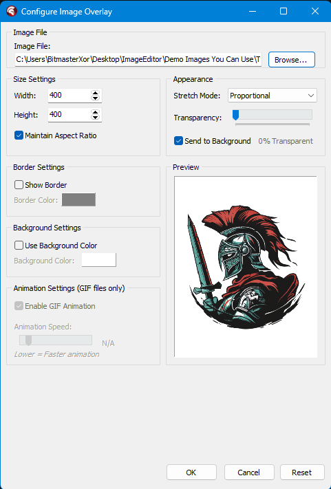
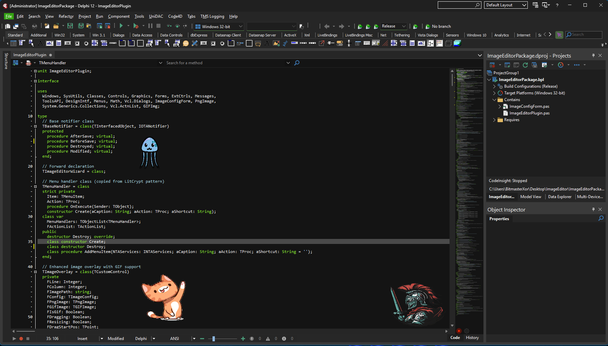

# 🎨 Delphi Code Sprites v1.0.0
**Add Fun Images & Animated Characters to Your Delphi Code Editor**

> **🎯 What it does:** Drop animated GIFs and fun images right into your Delphi code editor. Make coding more enjoyable with animated characters, memes, and visual flair!

---

## 🎬 Preview

### 🎮 **Fun Sprites in Your Code**

*Add some personality to your coding sessions!*

---

## ✨ Features

- 🎞️ **Animated GIFs** - Dancing characters, fun animations
- 🖼️ **PNG/JPG Support** - Memes, icons, fun images
- 🎮 **Animation Control** - Speed up or slow down GIFs
- 🖱️ **Drag & Drop** - Move your sprites around
- 👻 **Transparency** - Blend sprites with your code
- 🎯 **Multi-Editor** - Add fun to all your code windows

---

## 📦 Installation

1. **Download** this repository
2. **Open** `DelphiCodeSprites.dpk` in Delphi
3. **Build** and **Install** the package
4. **Find** new menu items in Tools menu

---

## 🚀 Quick Start

1. **Tools → Add Sprite to Editor...**
2. **Browse** for your favorite GIF or image
3. **Adjust** size and animation speed
4. **Click OK** - watch your code come alive!
5. **Drag** to move, **resize** with corners
6. **Double-click** to remove

---

## 🎯 Perfect For

- 🎮 **Gaming Projects** - Add game characters to game code
- 😂 **Meme Integration** - Your favorite reaction GIFs
- 🎭 **Animated Mascots** - Company or project mascots
- 🎨 **Creative Coding** - Make boring code sessions fun
- 🎉 **Team Morale** - Shared laughs during code reviews
- 🚀 **Personal Flair** - Express your coding personality

---

## 🔧 Requirements

- ✅ Delphi XE2 or later
- ✅ Windows 7+
- ✅ No external dependencies
- ✅ Sense of humor recommended!

---

## 📞 Support

- **Issues**: GitHub Issues
- **Discord**: bitmasterxor

---

**🎮 Make Coding Fun Again!**

**Made By BitmasterXor With ❤️ for the Delphi Community**

